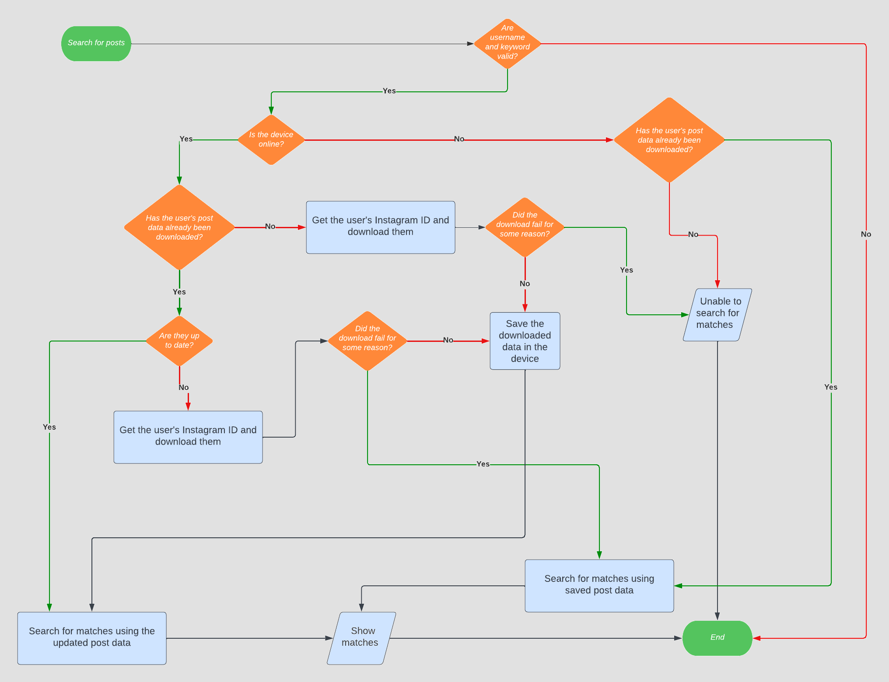

<h1 align="center">Instagram Post Finder (IGPF)</h1>

<h2>Disclaimer &#9888;&#65039;</h2>
IGPF doesn't belong or is related to the official Instagram application\website in any way; I developed it as an independent and unofficial application. 
Responsibility for consequences of using this application remains with the user; <b>I'm not responsible for how you use it</b>. 
Instagram has gotten increasingly strict with <a href="https://en.wikipedia.org/wiki/Web_scraping" target="_blank" rel="noopener noreferrer">scraping</a>; use the application responsibly and respectfully.

<h2>Premise &#128226;</h2>
At the time of writing (<b>2023-03-23</b>) IGPF has been successfully tested but, as has already happened in the past, <b>Instagram may change its APIs again</b>, and it may no longer work (or may work partially). 
If this were to happen, adapting the application to the new APIs shouldn't be very complicated, unless the changes made by Instagram were radical. The pieces of code to fix will probably be those that allow IGPF to get the user's JSON files from URL, and those related to their parsing.

<h2>What is it for? &#129300;</h2>
It is an Android application designed to search <b>public</b> posts of an Instagram user by keyword, and you don't need to have an Instagram account to use it. 
Since, at the time of writing, Instagram doesn't allow its users to make public only some posts if they have a private account, <b>this application can only be used to search posts of a user who have a public Instagram account</b>.

<h2>How it works? &#9881;&#65039;</h2>
Once the Instagram username and the keyword have been entered, IGPF will list all the links to the user's posts whose caption contains the keyword. 
 
About the keyword:
<ul>
  <li>
    If the keyword is contained in another word (e.g. keyword = <b>example</b> and word = counter<b>example</b>s), it will still be recognized.
  </li>
  
  <li>
    Keyword searching is case insensitive (e.g. keyword = hello and word = HeLLo is equivalent to keyword = hello and word = hello).
  </li>
  
  <li>
    The keyword can contain any symbol (therefore, for example, it can also be an hashtag), with the exception of spaces (otherwise you would be entering several keywords and not just one).
  </li>
</ul>

If matches are found (listed as Instagram image <a href="https://elfsight.com/blog/2015/10/how-to-get-instagram-photo-shortcode/" target="_blank" rel="noopener noreferrer">shortcodes</a>), just tap on one to view the matching post and its caption. The post will be shown through your device’s default browser (or through the Instagram app (if it's installed)).

<h2>Demo &#127910;</h2>
Username of the Instagram user with public profile: <a href="https://www.instagram.com/barol92/" target="_blank" rel="noopener noreferrer">barol92</a>. 
Keyword: #budapest. 
Expected result: IGPF will list all the links to the barol92's posts whose caption contains #budapest. 
 

  

<h2>Instagram put a limit on the number of requests &#9940;</h2>
Whenever you want to search public posts of an Instagram user by keyword, IGPF makes several HTTP GET requests to Instagram, depending on the number of posts that the user has published; the more there are, the more requests it must make. 
If the requests don't come from a logged-in Instagram user (as in the case of IGPF, which doesn't require any login to Instagram (and consequently doesn't have any <a href="https://docs.oceanwp.org/article/487-how-to-get-instagram-access-token" target="_blank" rel="noopener noreferrer">Instagram Access Token</a>)), Instagram, after a certain number of requests, will <a href="https://www.combin.com/blog/action-blocked-on-instagram-what-triggers-and-how-to-get-rid-of-it-70d058a366c9/" target="_blank" rel="noopener noreferrer">temporarily block</a> the IP address where the requests come from. 
Instagram typically unblocks the IP address within 24 hours (from tests I've done there doesn't seem to be an exact number of hours; it often changed from test to test), but it is possible to bypass the block. If your device is connected to the wireless network you can change its IP address by connecting it to the mobile network (and vice versa), as shown below. 
 

  

<h2>The offline mode &#128244;</h2>
IGPF saves user's posts data locally after downloading. 
IGPF avoids re-downloading user's posts data if they have already been downloaded in the current day; searches for matches by directly analyzing the already downloaded data. 
 
IGPF only downloads the user's posts data in the following two cases:
<ol>
  
  <li>
    The user's posts data have never been downloaded.
  </li>
  
  <li>
    The user's posts data were downloaded at least a day ago (this means that the user may have published new posts that need to be analyzed). In this case the old data will be overwritten with new ones.
  </li>
  
</ol>

If the device can't connect to the Internet or an error occurs while downloading the user's posts data, IGPF searches for matches analyzing the already downloaded data (if any), even if they're not up to date (better than nothing... &#129335;). 
 
This way of proceeding has the following advantages:

<ul>
  
  <li>
    There's no need to wait for user's posts data to download, so matches are found much faster.
  </li>
  
  <li>
    You can search for matches when your device is offline and view them when it's online.
  </li>
  
  <li>
    Instead of exhausting the maximum number of HTTP GET requests we can make to Instagram downloading the users posts data that we already have, we can download the user's posts data that we don't have yet.
  </li>
  
</ul>

The only case in which it will not be possible to find matches is when the device is not online and the user's posts data were never downloaded (or in case there're no matches, of course...). 
 

  

<h2>The IGPF logic &#128104;&#8205;&#128187;</h2>

  

<h2>Easter egg &#129370;</h2>
IGPF contains an easter egg; find it! &#128269; 
Fiddle around with the graphical interface of the app to find it, and if you can't find it and want to give up, take a look at the code, I wrote a comment to locate it.

<h2>Download links &#128229;</h2>
<a href="https://github.com/LucaBarile/InstagramPostFinder/raw/main/IGPF.zip" target="_blank" rel="noopener noreferrer">Here</a> you can download the Android project. 
<a href="https://github.com/LucaBarile/InstagramPostFinder/raw/main/IGPF.apk" target="_blank" rel="noopener noreferrer">Here</a> you can download the APK. 

<h2>Credits &#128591;</h2>
<ul>
  <li>
    Dan for <a href= "https://www.url-encode-decode.com/" target="_blank" rel="noopener noreferrer">this</a> useful tool.
  </li>
  
  <li>
    Neeraj Mishra for <a href= "https://www.thecrazyprogrammer.com/2017/01/android-json-parsing-from-url-example.html" target="_blank" rel="noopener noreferrer">this</a> article about JSON parsing.
  </li>
  
  <li>
    Tim Großmann for the <a href= "https://github.com/InstaPy/instapy-research/blob/master/api/old_api/README.md#graphql-modifiable-data-endpoints" target="_blank" rel="noopener noreferrer">list</a> of query IDs to use via GraphQL.
  </li>
  
  <li>Carlos Henrique Reis for <a href= "https://carloshenriquereis-17318.medium.com/how-to-get-data-from-a-public-instagram-profile-edc6704c9b45" target="_blank" rel="noopener noreferrer">this</a> article about getting data from a public Instagram profile.
  </li>
  
  <li>
    The <a href= "https://stackoverflow.com/" target="_blank" rel="noopener noreferrer">Stack Overflow</a> community for helping me to solve some programming problems.
  </li>
  
  <li>
    The beta testers <a href= "https://www.instagram.com/teti_topo/" target="_blank" rel="noopener noreferrer">Fabio Scaravelli</a> and <a href= "https://portale.fitet.org/images/atleti/612496.jpg" target="_blank" rel="noopener noreferrer">Davide Barbieri</a>.
  </li>
</ul>

<a href="https://lucabarile.github.io/" target="_blank">Here</a> you can visit my website &#127760; 
<a href="https://www.buymeacoffee.com/LucaBarile" target="_blank">Here</a> you can buy me a unicorn &#129412;

<h5 align="right">Share the Knowledge!</h5>
